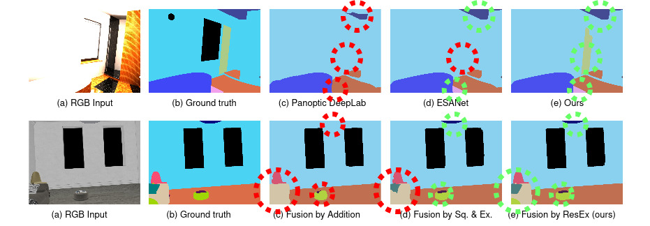

# Robust Double-Encoder Network for RGB-D Panoptic Segmentation

This repo contains the code of the paper *Robust Double-Encoder Network for RGB-D Panoptic Segmentation*, by [M. Sodano](https://github.com/matteosodano) et al., submitted to the IEEE International Conference on Robotics and Automation (ICRA) 2023. [Link]() to the ArXiv version of the paper (available soon). 

## Abstract
Perception is crucial for robots that act in real-world environments, as autonomous systems need to see and understand the world around them to act appropriately. Panoptic segmentation provides an interpretation of the scene by computing a pixel-wise semantic label together with instance IDs. In this paper, we address panoptic segmentation using RGB-D data of indoor scenes. We propose a novel encoder-decoder neural network that processes RGB and depth separately through two encoders. The features of the individual encoders are progressively merged at different resolutions, such that the RGB features are enhanced using complementary depth information. We propose a novel merging approach called ResidualExcite, which reweighs each entry of the feature map according to its importance. With our double-encoder architecture, we are robust to missing cues. In particular, the same model can train and infer on RGB-D, RGB-only, and depth-only input data, without the need to train specialized models. We evaluate our method on publicly available datasets and show that our approach achieves superior results compared to other common approaches for panoptic segmentation.

## Results
Quantitative results of our method against baselines (further details on the linked paper):

|Method|Dataset|PQ|mIoU|
|:------:|:-------:|:------:|:-----:|
|RGB Panoptic DeepLab|ScanNet|30.11|43.12|
|RGB-D Panoptic DeepLab|ScanNet|31.43|45.45|
|ESANet with Addition|ScanNet|35.65|51.78|
|ESANet with SE|ScanNet|37.09|54.01|
|Ours with CBAM|ScanNet|39.11|58.11|
|Ours with ResidualExcite|ScanNet|**40.87**|**58.98**|
|RGB Panoptic DeepLab|HyperSim|26.10|40.45|
|RGB-D Panoptic DeepLab|HyperSim|28.56|41.08|
|ESANet with Addition|HyperSim|32.18|50.74|
|ESANet with SE|HyperSim|35.87|54.07|
|Ours with CBAM|HyperSim|37.02|54.21|
|Ours with ResidualExcite|HyperSim|**38.67**|**55.14**|

Quantitative results of our method against baselines for Semantic Segmentation only (further details on the linked paper):
|Method|Dataset|mIoU|
|:------:|:-------:|:------:|
|AdapNet++|ScanNet|54.61|
|FuseNet|ScanNet|56.65|
|SSMA|ScanNet|66.13|
|Ours (full)|ScanNet|58.98|
|Ours (semantic-only)|ScanNet|**69.78**|

For further quantitative results, please refer to the [paper]()! :wink:

Qualitative results of our method against baselines on the HyperSim dataset:

## Code
Coming soon!

## Citation
If you use our framework for any academic work, please cite the original [paper]().

> bibtex entry coming soon!

## Acknowledgment
This work has partially been funded by the European Union’s Horizon 2020 research and innovation programme under grant agreement No 101017008 (Harmony).
